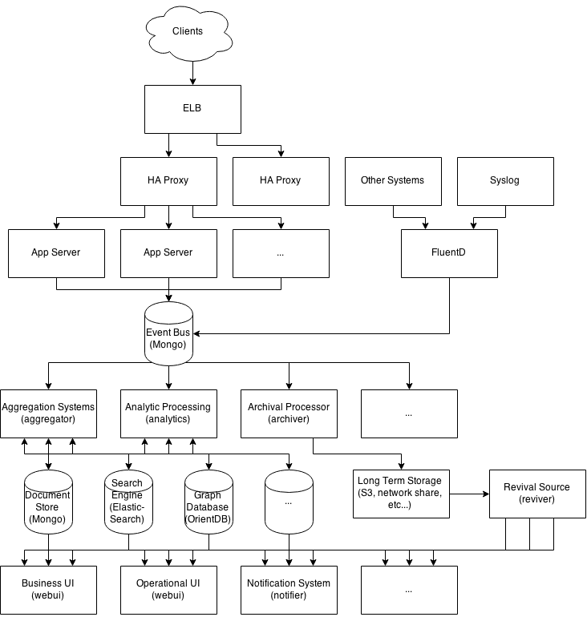
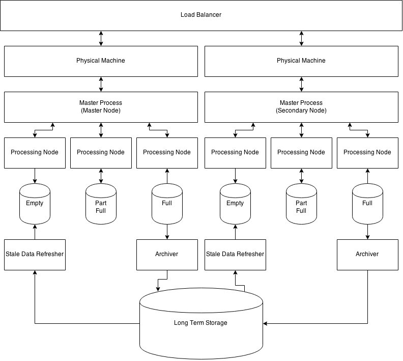

Precis
======

A different kind of eventing, logging, monitoring, and alerting product.  We
threw out all the rules and started from scratch to build something completely
different.

Precis started out in its prototype form as a
[Monolithic Application](http://en.wikipedia.org/wiki/Monolithic_application)
to prove that logging and alerting were better suited to an event sourcing
model.

The goals were simple, build a logging system that could provide aggregate
reports, basic monitoring, and alerting through notifications sent via Email,
HipChat, etc...

Once the basics were in place and the concept was proven then the overall
architecture and approach were finalized.

Getting Started
===============

Code is being wrapped up, and soon there will be projects and packages for both
a full system deployment (as a development environment) and individual services
(for production and larger environments).  Just keep an eye out here.

Architecture
============

Architectural Overview
----------------------

Precis is designed around mircoservices.  Any part of the stack can be
easily swapped out for another product or service without rearchitecting the
rest of the stack.  Granted, switching out the Event Bus that is used to move
log messages from the application or system layers may be a bit more challenging
as it will require that you update the configurations on the Aggregation
Systems, Analytics Processors, Archival Processor, and any other 1st level
consumers. Still this is made as easy as possible by making the Event Bus a
plugin to each project.

As you can see in the diagram above Precis works with 3rd party
applications pushing data to the Event Bus as long as the 3rd party application
knows how to work with the Event Bus.  In the example above FluentD is pushing
data directly from Syslog and other systems into the (default) MongoDB that is
being used as the Event Bus.

Consumers tie directly to the data store they need access to.  Dashboarding
could be fed from the aggregates stored in MongoDB.  Kibana could be stacked on
top of Elastic Search, and/or a graph frontend could be used on top of OrientDB
(Neo4J, Titan, or whatever GraphDB you choose to use).

The Archiver is responsible for taking data from the event bus, recording it to
a daily log, compressing it once the day is over, and moving the compressed
archive off to Long Term Storage (by default S3).  This allows for the actual
log data to roll off the event bus once everything is done being processed.

Letting data roll off provides another problem though, what happens when we need
the data back.  This is where the Revival Source comes in to play.  The Revival
Source is responsible for taking the archives and making the available to any
consumer.  It provides a very simple to use RESTful interface that allows the
fetching of specific records by ID or date/time filter.  In the future the
Revival Source will be expanded to support querying the archives in a manor
similar to what MongoDB does today.

MongoDB as an Event Bus
=======================

If you didn't ask why we by default Precis was designed around MongoDB,
you should have.  There are other products on the market that could have been
selected such as RabbitMQ, EventStore, and others.  Eventually the plan is to
support these products as the Event Bus as well.

Precis Revival Future Plans
===========================

Here is a high level overview of the future plans for the Precis Revival:

The basic idea is to create a self balancing system that can provide truly long
term storage that can scale to Zetabyte data stores yet still provide "fast"
access to the archived data.

So, what's the plan to achieve this.  Simple, build LOTS of small processors
that handle minimal data and build interlinked indexes that make finding and
reviving data simple, fast, and easy.  Sound crazy, maybe, but it's so simple
it should work.

More details will be provided once this system is undertook.
